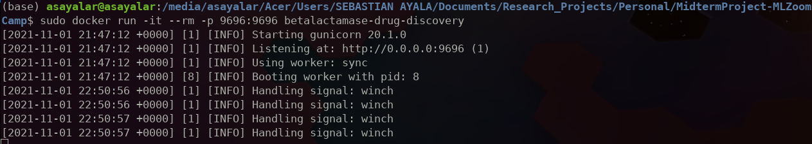
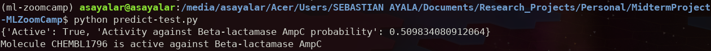
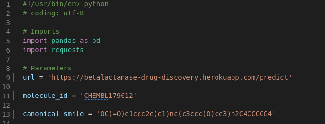

# **Midterm Project of the Machine Learning ZoomCamp course**

## **Table of contents:**

- [About the project](#about-the-project)
- [Dataset](#dataset)
- [Data preparation and feature matrix](#data-preparation-and-feature-matrix)
- [Machine Learning Models](#machine-learning-models)
- [Python virtual environment and installation of required libraries](#python-virtual-environment-and-installation-of-required-libraries)
- [How to run this app as a web service in a local server?](#how-to-run-this-app-as-a-web-service-in-a-local-server)
- [How to run this app as a web service in the cloud?](#how-to-run-this-app-as-a-web-service-in-the-cloud)
- [Structure of the repository](#structure-of-the-repository)
- [How to contribute with the Open Bioinformatics Research Project?](#how-to-contribute-with-the-open-bioinformatics-research-project)
- [Contact](#contact)

## **About the project**

For my midterm project of the [Machine Learning Zoomcamp](https://github.com/alexeygrigorev/mlbookcamp-code/tree/master/course-zoomcamp), I decided to work in the Open Bioinformatics Research Project proposed by [Data Professor](https://github.com/dataprofessor), which is related to Computational Drug Discovery.

This project aims to evaluate the activity of molecules that have been experimentally tested to bind or not bind to [Beta-Lactamases](https://en.wikipedia.org/wiki/Beta-lactamase). Some of these proteins allow multi-drug resistant bacteria or superbugs to inactivate a wide range of penicillin-like antibiotics, which is known as antimicrobial resistance (AMR). According to the World Health Organization, AMR is one of the [top ten global public health threats facing humanity in this century](https://www.who.int/news-room/fact-sheets/detail/antimicrobial-resistance), so it is important to search for potential compounds that combat these superbugs and prevent AMR, which is the aim of this project. You can find detailed information about AMR and Beta-Lactamase in this [blog](https://pdb101.rcsb.org/motm/187).

## **Dataset**

The [dataset](https://www.kaggle.com/thedataprof/betalactamase) consists of 136 csv files with information of interactions between small molecules and Beta-Lactamases. These features are listed below:

* `molecule_chembl_id:` unique CHEMBL identifier of the molecule.
* `canonical_smiles:` one-dimensional representation of chemical structure from the molecule.
* `standard_value:` bioactivity value, which was experimentally measured. Standard value can be defined as the concentration of a drug, and if this value is lower the drug has better bioactivity because it requires low concentration to have an effect. This can be the target variable for machine learning models.
* `standard_relation:` this value tells if the standard value was reported as a finite number or if this value is greater than or lower than a particular number.
* `standard_units:` units of the bioactivity value.
* `standard_type:` type of experimental assay used to measure the bioactivity value.
* `pchembl_value:` bioactivity value that combines measurements from IC50 and Ki assays, and applies a negative logarithmic transformation. This can be the target variable for machine learning models.
* `target_pref_name:` name of protein tested to interact with the molecule.
* `bao_label:` bioactivity experiment standard label.

## **Data preparation and feature matrix**

The feature matrix to train machine learning models was obtained by calculating molecular descriptors from the `canonical_smiles` of molecules. These molecular descriptors are also known as molecular fingerprints, and they are property profiles of molecules, represented as vectors with each vector element representing the existence or the frequency of a structural feature. The extraction of molecular fingerprints from SMILES was performed with [PaDEL](http://www.yapcwsoft.com/dd/padeldescriptor/) software, following instructions from [this video](https://youtu.be/rEmDyZHz5U8).

PaDEL has 12 available fingerprints, but for this project, we calculated 10 of them because KlekotaRothFingerprintCount and KlekotaRothFingerprinter required a long computing time to be obtained.

In addition, it is important to notice that this dataset contains interaction data of molecules with various Beta-lactamases. Therefore, we can create independent machine learning models for each of these proteins, or a single unified model for all of them, which is known as the proteochemometric model. In this project, I created independent models for **Beta-lactamase AmpC**.

## **Machine Learning Models**

For this project, I tested three machine learning models, including Logistic Regression, Random Forest, and XGBoost, for a binary classification task. I chose `pchembl_value` as the target variable. To fine-tune hyperparameters, I used sklearn class [GridSearchCV](https://scikit-learn.org/stable/modules/generated/sklearn.model_selection.GridSearchCV.html#sklearn.model_selection.GridSearchCV).

## **Python virtual environment and installation of required libraries**

I used [Pipenv](https://pypi.org/project/pipenv/) to create a Python virtual environment, which allows to manage python libraries and their dependencies. Each Pipenv virtual environment has a `Pipfile` with the names and versions of packages installed in the virtual environment, and a `Pipfile.lock`, a json file that contains versions of packages, and dependencies required for each package.

To create a Python virtual environment with libraries and dependencies required for this project, you should clone this GitHub repository, open a terminal, move to the folder containing this repository, and run the following commands:

```bash
# Install pipenv
$ pip install pipenv

# Create the Python virtual environment 
$ pipenv install

# Activate the Python virtual environment 
$ pipenv shell
```

You can find a detailed guide of how to use pipenv [here](https://realpython.com/pipenv-guide/).

However, you do not need to run these commands because I created a Dockerfile that installs all Operative System and Python requirements, as is explained in the next section.

## **How to run this app as a web service in a local server?**

[Docker](https://www.docker.com/) allows to create **containers**, which are isolated environments with specific system requirements such as OS, libraries, programs, dependencies, among others. You can follow [instructions of the official documentation](https://docs.docker.com/engine/install/) to install this program, depending on your OS and other details.

The specifications of the docker container are stated in the `Dockerfile`, including the base image, instructions for installing libraries, files we need to copy from the hots machine, and other instructions.

Once you have installed Docker, move to the folder containing this repository, and run the following commands:

```bash
# Build a docker image with specifications for this project stated in the Dockerfile
$ (sudo) docker build -t betalactamase-drug-discovery .

# Run the docker image 
$ (sudo) docker run -it --rm -p 9696:9696 betalactamase-drug-discovery
```

The screen-shot below shows how your terminal should looks like after running the docker image:

<br />



<br />

Then, you should open other terminal and run the `predict-test.py` python script, and you will obtain a prediction if the molecule defined with the `canonical_smile` variable of the script will bind or not to the Beta-lactamase AmpC. The following screen-shot shows the expected result:

<br />



<br />

If you want to make predictions on other molecules, replace the `canonical_smile` variable of the `predict-test.py` python script with the corresponding SMILE.

## **How to run this app as a web service in the cloud?**

I used [Heroku](https://www.heroku.com/home) for hosting the web service in the cloud. For doing the deployment into the cloud, I followed [a tutorial](https://github.com/nindate/ml-zoomcamp-exercises/blob/main/how-to-use-heroku.md) provided by one of the members of the Machine Learning Zoomcamp, which has details and code required to deploy a web service to the cloud with Heroku.

If you want to try this option, you can replace the `url` variable of the `predict-test.py` python script with this link: https://betalactamase-drug-discovery.herokuapp.com/predict, as is shown in the following screen-shot:

<br />



<br />

Then, you need to run the python script in a terminal as in the last section, and you should obtain the same output without running the docker container locally.

## **Structure of the repository**

The main files and directories of this repository are:

|File/Folder|Description|
|:-:|---|
|[EDA_Binary_classifiers_beta_lactamase_drug_discovery.ipynb](EDA_Binary_classifiers_beta_lactamase_drug_discovery.ipynb)|Jupyter notebook with EDA, feature matrices preparation, machine learning models, performance metrics of all models, and evaluation of the best model|
|[train.py](train.py)|Python script to train the best classifier|
|[predict.py](predict.py)|Python script to make predictions with the best classifier using a Flask's web service|
|[predict-test.py](predict-test.py)|Python script to send a request to the Flask's web service to make a prediction|
|[RandomForest_maxdepth10_nestimators200.bin](RandomForest_maxdepth10_nestimators200.bin)|File of the best classifier|
|[Dockerfile](Dockerfile)|Docker file with specifications of the docker container|
|[Pipfile](Pipfile)|File with names and versions of packages installed in the virtual environment|
|[Pipfile.lock](Pipfile.lock)|Json file that contains versions of packages, and dependencies required for each package|
|[low_var_feat_names.csv](low_var_feat_names.csv)|File with names of the low variance features of CDK fingerprint|
|[Data/](Data/)|Original dataset, input file for PaDEL software, data for training machine learning models, zip files with xml file to calculate PaDEL fingerprints and feature matrices of 10 PaDEL's fingerprints|
|[Output/](Output/)|Folder to save performance metrics' results of machine learning models|
|[Img/](Img/)|Folder to save images|

## **How to contribute with the Open Bioinformatics Research Project?**

More information about this project and how to contribute to it in this [video](https://youtu.be/_GtEgiWWyK4).

## **Contact**

If you have comments or suggestions about this project, you can [open an issue](https://github.com/sayalaruano/MidtermProject-MLZoomCamp/issues/new) in this repository, or email me at sebasar1245@gamil.com.
